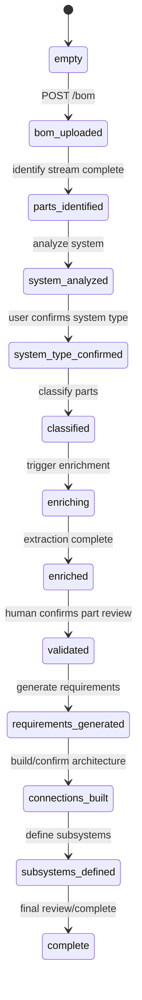

# Workflow State Machine

Last updated: 2026-05-28

## Purpose

The workflow state machine controls which product page is active, which pages are
unlocked, and which backend stages have completed. The DB FSM is canonical.
Frontend page state is only a view over backend state.

## Canonical Backend FSM

Defined in `design_evolution_api_v2/domain/enums.py`.

| FSM state | Meaning |
| --- | --- |
| `empty` | Design exists, no BOM persisted yet. |
| `bom_uploaded` | BOM rows are persisted into `design_parts`; part identification may run. |
| `parts_identified` | Identification lookup completed; unresolved/web/custom review may still be required. |
| `system_analyzed` | System type suggestions exist; user still must confirm one. |
| `system_type_confirmed` | User confirmed the system type; classification may run. |
| `classified` | Parts have auxiliary/non-auxiliary classifications. |
| `enriching` | Model/pin/spec extraction jobs are queued/running. |
| `enriched` | Enrichment stage completed or had nothing to enrich. |
| `validated` | Human confirmed part review after enrichment. |
| `requirements_generated` | Requirements exist and can be reviewed. |
| `connections_built` | Architecture connections/nets exist and can be reviewed. |
| `subsystems_defined` | Subsystems exist. |
| `complete` | Workflow complete. |

## Derived Frontend Stage Numbers

Defined in `src/app/shared/utils/workflowStages.ts` and mirrored by
`design_evolution_api_v2/services/workflow_progress.py`.

Stage number means the highest unlocked page, not necessarily the last completed
page.

| Stage | Route | Label | Unlock source |
| --- | --- | --- | --- |
| 1 | `/upload` | Upload | `empty` |
| 2 | `/part-identification` | Part Identification | `bom_uploaded` or identification blockers |
| 3 | `/system-identification` | System Identification | `parts_identified` with no blockers, or `system_analyzed` |
| 4 | `/classification` | Classification | `system_type_confirmed` |
| 5 | `/enrichment` | Enrichment | `classified` or `enriching` |
| 6 | `/validate` | Part Review | `enriched` |
| 7 | `/requirements` | Requirements | `validated` |
| 8 | `/architecture` | Architecture | `requirements_generated` |
| 9 | `/subsystems` | Subsystems | `connections_built` |
| 10 | `/completed` | Review/Completed | `subsystems_defined` or `complete` |

## Review Blocker Exception

`parts_identified` does not always unlock System Identification.

If any distinct part group still has:

- `web_unresolved`
- `not_found`

then `GET /api/designs/{id}` returns `current_stage = 2`, keeping the user on
Part Identification review.

## Layout Guard

Implemented in `src/app/shared/components/Layout.tsx`.

Behavior:

1. Read `session` query param or session context.
2. Fetch canonical backend design via `GET /api/designs/{id}`.
3. Store returned `current_stage` in session context.
4. If the user is on a locked route, redirect to the highest unlocked route.
5. Preserve `?session={id}` during stage navigation.

## Stage Indicator

Implemented in `src/app/shared/components/StageIndicator.tsx`.

Rules:

- Current route is active.
- Stages lower than `current_stage` are complete.
- Stages up to `current_stage` are available.
- Stages higher than `current_stage` are locked.
- Upload is intentionally not navigable once a design session exists unless the
  user starts a new upload from the library.

## Temporal Boundary

Current intended design:

- DB FSM is the product source of truth.
- Page-owned simple stage triggers run through direct backend routes/services.
- Durable long-running stages can use dedicated Temporal workflows where
  appropriate, especially architecture and requirements.
- Upload no longer starts `DesignIngestionWorkflow` in the background.

## Mermaid Overview

## Known Review Risks

- Some pages still combine local optimistic progress with backend progress; the
  backend response must always win.
- Any page that skips review because `current_stage` is already high should first
  check whether reviewable saved state exists.
- Temporal status endpoints should be treated as execution telemetry, not as the
  product FSM.

