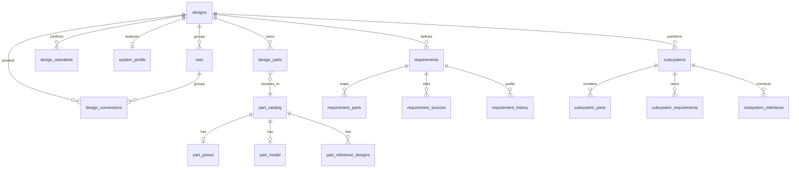

# Database Models

Backend source: `C:\Users\alzai\Desktop\repos\agent-exmaple\design_evolution_api_v2\models`

This document maps the V2 backend database models used by the page-flow docs.
The DB FSM in `designs.fsm_state` is the source of truth for stage unlocks.
Frontend `current_stage` is derived from that state and should never become its
own source of truth.

## Ownership Rules

- Page data must reload from backend tables after every long-running stage.
- User-confirmed rows must not be silently overwritten by AI reruns.
- AI-generated rows should use explicit status fields, not missing values.
- Audit/proposal tables preserve intent; canonical tables drive the app UI.
- Frontend graph models are view models only; persisted nets/connections are
  the architecture source of truth.

## Core Design Tables

### `designs`

Primary workflow record.

Important fields:

- `id`: design/session id used by all routes.
- `project_name`: user-facing design name.
- `fsm_state`: canonical workflow state.
- `workflow_status`: coarse execution status such as idle/running/error.
- `context_json`: design-level context and metadata.
- `created_at`, `updated_at`.

Owned by:

- Library
- Upload
- global route guard and stage indicator

### `versions`

Version graph between parent and child designs. Used by future design evolution
branches and candidate designs.

### `design_standards`

Confirmed design-level standards selected during system identification.

Important fields:

- `design_id`
- `standard`
- `confirmed_at`

Owned by:

- System Identification
- Requirements
- Compliance/validation flows

## BOM And Part Identity

### `design_parts`

Design-scoped BOM instances. One physical/logical BOM row can expand into many
instances.

Important fields:

- `id`: design part instance id.
- `design_id`
- `mpn`: original or resolved MPN, linked to `part_catalog.mpn`.
- `quantity`, `designator`, `instance_index`, `instance_id`.
- `classification`: auxiliary vs non-auxiliary.
- `category`, `component_id`, `instance_function`.
- `identification_status`: `identified`, `web_unresolved`,
  `web_confirmed`, `custom`, `not_found`.
- `suggestions_json`: candidate matches requiring review.
- `selected_mpn`: user-selected canonical MPN when different from original.
- `resolved_at`.

Owned by:

- Upload creates rows.
- Part Identification updates identity fields and statuses.
- Classification updates classification/function fields.
- Subsystems reference rows through join tables.

### `design_custom_parts`

Design-local part evidence for proprietary or missing catalog parts.

Important fields:

- `design_id`
- `mpn`
- `description`, `manufacturer`, `category`
- `datasheet_storage_path`, `datasheet_url`
- `params`

Owned by:

- Part Identification custom part flow.

### `part_catalog`

Global MPN cache. This is the main technical detail source shown on part cards.

Important fields:

- `mpn`
- `manufacturer`, `category`, `description`
- `datasheet_url`, `product_url`
- `part_function`, `topology_family`
- `params`: structured technical parameters.
- `pricing`, `availability`
- `source`: `nexar`, `web`, `user`, etc.
- `confidence`
- `web_contributions`
- `extraction_error`
- `datasheet_source`, `datasheet_candidates_tried`
- `nexar_fetched_at`, `fetched_at`

Owned by:

- Part Identification lookup/cache.
- Enrichment may correct or enrich identity/detail fields.
- Part Review and Architecture read technical detail from here.

### `part_pinout`

Global pinout for an MPN.

Important fields:

- `mpn`
- `package`
- `pin_count`
- `pins`: list of pin names/numbers/types/directions.
- `confidence`
- `extracted_at`

Owned by:

- Enrichment/part model extraction.
- Pin-resolution reads this as the primary pin source.
- Architecture renders active handles from this data.

### `part_model`

Global structured electrical model extracted from datasheets.

Important fields:

- `mpn`
- `model_data`: interfaces, power domains, compatible categories,
  constraints, ratings, application notes.
- `extracted_at`

Owned by:

- Enrichment.
- Connection inference reads this for component-level connections.
- Pin resolver reads interface and power summaries.
- Part model drawer reads this for engineering review.

### `part_reference_designs`

Cached reference design/topology evidence for a part and system type.

Important fields:

- `mpn`
- `system_type`
- `source_url`
- `topology`
- `fetch_status`

Owned by:

- Enrichment/topology discovery.

## System Analysis And Compliance

### `system_profile`

System-level interpretation for the design.

Important fields:

- `design_id`
- `suggestions`: AI candidates before user confirmation.
- `system_type`
- `primary_function`
- `architectural_clues`
- `application_domains`
- `suggested_standards`
- `confirmed_at`

Owned by:

- System Identification.
- Requirements and validation read confirmed system context.

### `compliance_results`

Validation/compliance findings per design, part, standard, or subsystem.

Important fields:

- `design_id`
- `design_part_id`
- `standard`
- `subsystem_id`
- `status`
- `failure_modes`
- `recommendations`

### `part_standards`

Part-level standard applicability.

Important fields:

- `design_id`
- `design_part_id`
- `standard`
- `source`

## Requirements

### `requirements`

Canonical design-level requirements.

Important fields:

- `req_id`
- `design_id`
- `req_key`, `title`, `category`
- `description`, `specification`
- `priority`
- `status`: suggested/confirmed/rejected style lifecycle.
- `provenance`
- `rationale`
- `acceptance_criteria`
- `verification_method`, `verification_status`
- `source_mpns`, `source_standards`
- `quality_warnings`
- `confidence`
- `ai_generated`
- timestamps

Owned by:

- Requirements page.
- Architecture and subsystems read requirements as inference context.

### `requirement_parts`

Join table from design-level requirements to design parts.

### `requirement_sources`

Evidence/provenance rows for requirements.

Important fields:

- `source_type`
- `source_id`
- `source_label`
- `field_path`
- `evidence_text`
- `confidence`

### `requirement_history`

Audit history for requirement changes.

Important fields:

- `event_type`
- `actor`
- `reason`
- `before`
- `after`

### `requirement_proposals`

Reviewable requirement changes proposed by AI or optimization runs.

Important fields:

- `proposal_type`
- `original_req_id`
- `target_requirement_id`
- `subsystem_id`
- `run_id`
- proposal content fields
- `status`: pending/committed/rejected
- timestamps

## Architecture, Nets, Pins, And Buses

### `design_connections`

Canonical reviewed architecture edge between two component MPNs.

Important fields:

- `id`
- `design_id`
- `net_id`: nullable link to canonical `nets`.
- `source_mpn`, `target_mpn`
- `connection_type`
- `signal_name`
- `reasoning`
- `confidence`
- `status`: suggested/confirmed/rejected.
- `ai_generated`
- `source_requirement_ids`
- `inference_sources`
- `source_pin`, `target_pin`
- `pin_confidence`
- `pin_reasoning`
- `pin_resolution_source`: deterministic/llm/manual/unresolved.
- `user_corrected`
- `created_at`

Owned by:

- Architecture page and connection inference services.

Guardrail:

- If `user_corrected = true`, reruns must preserve the row unless the user
  explicitly regenerates everything.

### `nets`

Canonical architecture net/link entity. This is the persistent backend source
for displayed net boxes such as `VBAT`, `5V`, `GND`, `CAN`, and custom links.

Important fields:

- `id`
- `design_id`
- `subsystem_id`
- `name`
- `net_type`
- `voltage`
- `is_boundary`
- `status`: suggested/confirmed/rejected/hidden/ungrouped.
- `ai_generated`
- `user_corrected`
- `confidence`
- `reasoning`
- `source_requirement_ids`
- `rule_metadata`
- `layout`: persisted graph position/config.
- timestamps

Owned by:

- Architecture page net CRUD.
- Connection inference/backfill groups connections into nets.
- Subsystems read boundary/interface nets.

Guardrail:

- Default delete should ungroup the net and preserve connections.
- Delete-links is explicit and dangerous.

### `part_instance_pins`

Design-instance pin rows. This is lower-level than `part_pinout` and supports
future exact instance-level netlists.

Important fields:

- `design_part_id`
- `pin_number`
- `pin_name`
- `pin_type`
- `direction`
- `source`

### `connections`

Normalized pin-to-pin connection rows using `part_instance_pins`.

Important fields:

- `design_id`
- `net_id`
- `pin_a_id`, `pin_b_id`
- `connection_type`
- `grounded_by`
- `reasoning`

Current role:

- Lower-level normalized model. The current Architecture UI primarily uses
  `design_connections` until the pin-instance model is fully adopted.

### `net_drivers`

Driver metadata for a net.

Important fields:

- `net_id`
- `pin_id`
- `driver_type`
- `voltage`

### `bus_definitions`

Logical bus record such as I2C, SPI, CAN, or LIN.

Important fields:

- `design_id`
- `name`
- `protocol`

### `bus_net_roles`

Maps bus roles/signals to nets, parts, and pins.

Important fields:

- `bus_id`
- `net_id`
- `signal_role`
- `design_part_id`
- `pin_id`

### `architecture_proposals`

Reviewable AI architecture patch proposal.

Important fields:

- `proposal_type`
- `title`
- `rationale`
- `payload`
- `evidence`
- `confidence`
- `created_by`
- `status`
- target/source net and connection ids
- `result_payload`
- `applied_at`, `dismissed_at`

Owned by:

- Architecture assistant/proposal flow.

## Subsystems

### `subsystems`

Canonical subsystem grouping.

Important fields:

- `subsystem_id`
- `design_id`
- `subsystem_key`
- `name`, `description`
- `topology`, `topology_family`
- `topology_confirmed`, `topology_confidence`
- `status`
- `ai_generated`
- `mpns`
- timestamps

### `subsystem_parts`

Join table from subsystem to design parts.

Important fields:

- `subsystem_id`
- `design_part_id`
- `role`
- `is_primary`

### `subsystem_interfaces`

Interfaces between two subsystems through a net.

Important fields:

- `design_id`
- `net_id`
- `source_subsystem_id`
- `target_subsystem_id`
- `signal_type`
- `description`

### `subsystem_constraints`

Structured constraint JSON for a subsystem.

### `subsystem_standards`

Subsystem-level standard applicability.

### `subsystem_requirements`

Subsystem-specific requirements.

Important fields:

- `req_id`
- `design_id`
- `subsystem_id`
- `req_key`
- `title`, `description`
- `criteria_json`
- `priority`, `status`
- `ai_generated`
- `rationale`
- `acceptance_criteria`
- `verification_method`, `verification_status`
- `source_mpns`
- `quality_warnings`
- `confidence`
- timestamps

### `subsystem_requirement_parts`

Join table from subsystem requirements to design parts.

## Observability And Assistant Context

### `workflow_events`

Append-only progress/event stream for workflows and long-running jobs.

Important fields:

- `design_id`
- `event_type`: progress/complete/error.
- `stage`
- `payload`
- `created_at`

### `chat_history`

Persistent assistant conversation scoped to a design.

Important fields:

- `design_id`
- `role`
- `content`
- `agent_name`
- `fsm_state`
- `page_context`
- `created_at`

## Evolution And Optimization

These tables support future optimization, substitution, and design evolution:

- `recommendations`
- `optimisation_runs`
- `explorations`
- `alternatives`
- `spec_suggestions`
- `ripple_effects`
- `subsystem_evolution_candidates`

## Canonical Relationships

## Review Checklist

- Does every UI edit persist into a canonical table?
- Is the same table re-read on refresh?
- Are suggested/confirmed/rejected states explicit?
- Are user-corrected rows protected from reruns?
- Are proposal/audit rows separate from canonical display rows?
- Does the page use a backend domain route/service instead of direct local-only
  mutation?
